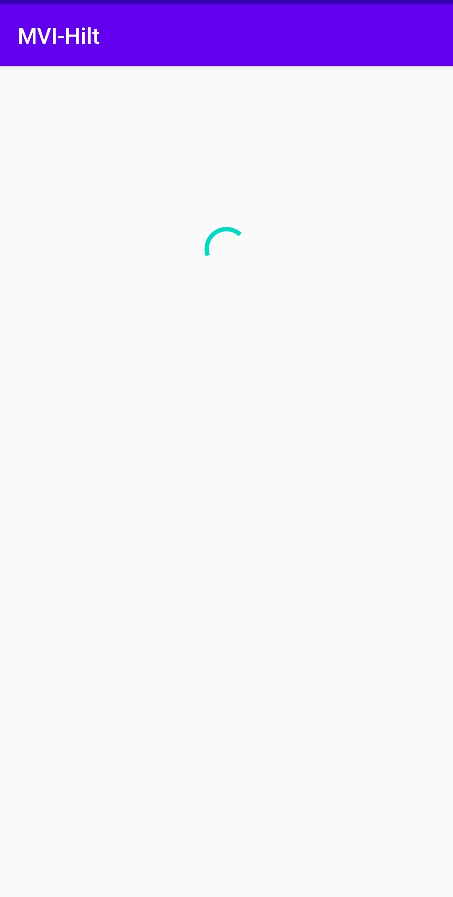

# Basic MVI Repository Pattern

The app is a re-implementation of @mitchtabian's [Dagger-Hilt-Playerground](https://github.com/mitchtabian/Dagger-Hilt-Playerground/tree/Basic-MVI-Repository-Pattern), as learning purpose. Currently it does the following:

1. Retrieve data from [open-api.xyz](https://open-api.xyz/placeholder/blogs) with [Retrofit](https://square.github.io/retrofit/)
2. Cache data with [Room](https://developer.android.com/topic/libraries/architecture/room)
3. Display cached data in UI

The app uses [Dagger-Hilt](https://dagger.dev/hilt/) for dependency injection and serve a basic template for MVI architecture using kotlin sealed classes for State Management. The app simply shows a progress bar for explicit delayed time and lists the titles of posts being fetched (Although entire post data is being fetched).

|                     Loading                      |                     Titles                      |
| :----------------------------------------------: | :---------------------------------------------: |
|  |  |

We could extend this app further, following the architecture guidelines and taking advantage of Hilt to manage our dependencies. Things that could be added:

- [ ] Survive configuration changes
- [ ] Use fragments for different screens
- [ ] Navigation component
- [ ] RecyclerView to view all the post details
- [ ] Caching Strategies
- [ ] WorkManager to update data in the background

